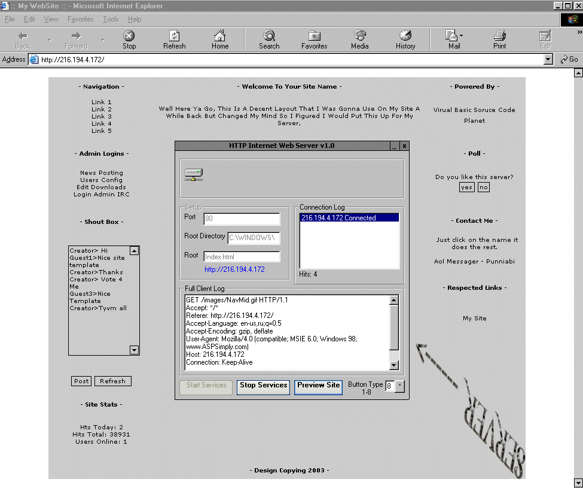



## WebServer Mini

### Description

This is a mini but very good web server it comes with a complete website template that you can edit on notepad soon coming in 2 weeks a version with GET/POST PHP
 
### More Info
 

             |
---                |---
**Submitted On**   |2003-11-15 16:37:20
**By**             |[RPG MAKER](https://github.com/Planet-Source-Code/PSCIndex/blob/master/ByAuthor/rpg-maker.md)
**Level**          |Advanced
**User Rating**    |4.7 (33 globes from 7 users)
**Compatibility**  |VB 4\.0 \(32\-bit\), VB 5\.0, VB 6\.0
**Category**       |[Complete Applications](https://github.com/Planet-Source-Code/PSCIndex/blob/master/ByCategory/complete-applications__1-27.md)
**World**          |[Visual Basic](https://github.com/Planet-Source-Code/PSCIndex/blob/master/ByWorld/visual-basic.md)
**Archive File**   |[WebServer\_16723811152003\.zip](https://github.com/Planet-Source-Code/rpg-maker-webserver-mini__1-49928/archive/master.zip)

